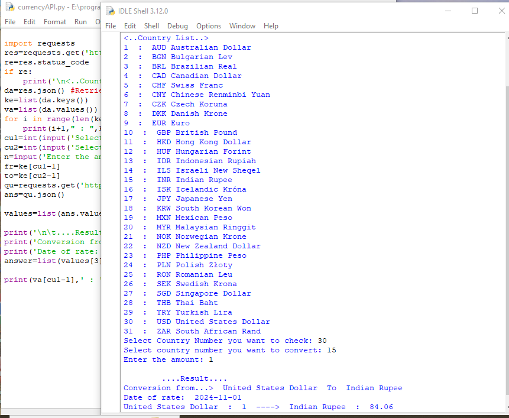
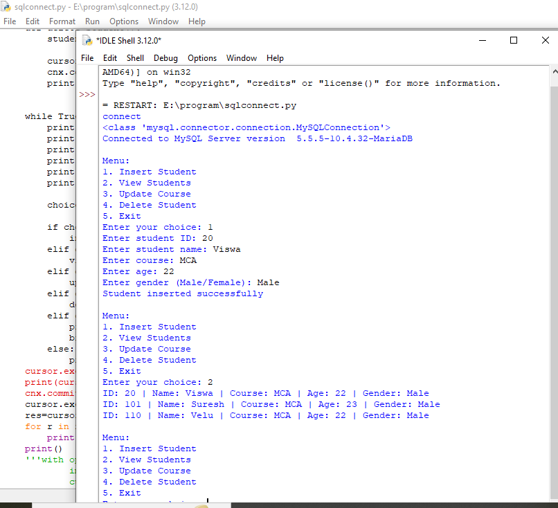
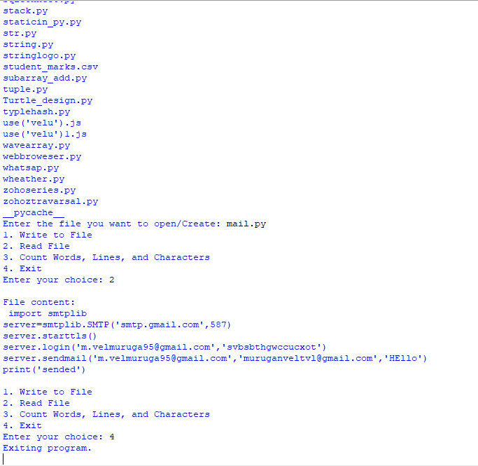

# Python Repository

This repository contains a collection of Python programs and scripts that I created to store and showcase my Python knowledge across different areas of programming. It includes examples of data visualization, database connectivity, Excel file handling, and simple logical programming.

## Contents

1. **Data Visualization**  
   - Examples of visualizing data using librarie `matplotlib`
   - Includes various chart types such as line plots, bar charts, and scatter plots.
   - Demonstrates customization options like colors, labels, legends, and layouts.

2. **Database Connectivity**  
   - Scripts that demonstrate how to connect Python to different databases (MySQL).
   - Shows how to execute queries, handle transactions, and fetch results.
   - Includes examples of CRUD operations (Create, Read, Update, Delete) using SQL.

3. **Excel File Handling**  
   - Programs to read from and write to Excel files using libraries like `pandas` and `xlrd`.
   - Includes examples for loading, modifying, and saving Excel sheets.
   - Demonstrates data manipulation, such as filtering, sorting, and aggregating data in Excel files.

4. **Simple Logical Programming**  
   - Collection of simple logical programs for basic Python programming skills.
   - Includes exercises in conditional statements, loops, functions, and algorithms.

#  Computer Vision Problems 
 
 **Augmented Reality**

[AR Testing](https://colab.research.google.com/drive/1wy2USwphgMm1H964yCNKTM6Sqc1Avk2T?usp=sharing)

## Currency converter App

**File**
[Code](currencyAPI.py)

## Crud Operation using MySql

[Code](sqlconnect.py)

## File Read write

[Code](filewriting.py)

